# Build codes and sharing
> Last verified against: 5e6ddd4 (2026-09-25).

## Overview

Build codes are portable snapshots of the renderer's save-relevant build state. `getBuildPayload()` in `src/renderer/src/utils/buildPayload.ts` collects that state, and the local backend encodes it as `tli1_<base64url(zlib_level9(compact_json))>`. A shared link stores that code with `api.tlibuilder.com`; the service stores and returns the code, while the app still decodes it locally.

The format is frozen. `backend/build_code.py` defines `CODE_PREFIX = "tli1"` and `SCHEMA_VERSION = 2`. Do not change the prefix, compression, Base64 URL encoding, or schema-version meaning. A schema change needs owner approval, a version bump, and a matching `_migrate()` branch that upgrades earlier payloads.

## Key Concepts

- **Build code.** The self-contained `tli1_` string returned by `encode_build()` in `backend/build_code.py`.
- **Share ID.** The short identifier returned by `shareBuildCode()` in `src/renderer/src/api/share.ts`. It lets the app fetch a stored build code from `https://api.tlibuilder.com/b/<id>`.
- **Strip and rehydrate.** `_strip_for_share()` removes the build ID and derived gear data before encoding. `decode_build()` uses the active season's legendary-gear catalog to restore a full gear shape through `_rehydrate_gear_item()`.
- **Known build keys.** `KNOWN_BUILD_KEYS` is in `src/renderer/src/utils/buildCompat.ts`, not `backend/build_code.py`. `checkBuildCompatibility()` uses it after import to flag top-level fields that the current renderer does not recognize.

## How It Works

```mermaid
flowchart LR
  P[getBuildPayload]
  E[POST /api/build-code/encode]
  C[encode_build]
  S[Strip derived gear fields]
  F[tli1_ code]
  H[POST https://api.tlibuilder.com/b]
  U[Share URL]
  R[resolveImportInput]
  G[GET https://api.tlibuilder.com/b/id]
  D[POST /api/build-code/decode]
  M[decode_build and _migrate]
  B[Imported build]

  P --> E --> C --> S --> F
  F --> H --> U --> R
  F --> R
  R --> G --> D
  R --> D --> M --> B
```

`ImportExportOverlay.tsx` calls `api.encodeBuildCode(getBuildPayload())` in `handleGenerate()`. `api.encodeBuildCode()` posts to `/api/build-code/encode` through the normal local-backend transport in `src/renderer/src/api/client.ts`. `encode_build_code()` in `backend/server.py` calls `encode_build()`, which strips the payload, adds `v`, serializes sorted UTF-8 JSON with compact separators, compresses it with zlib level 9, Base64 URL-encodes it without padding, and prefixes it with `tli1_`.

`_strip_gear_item()` retains source fields for each gear item. It keeps custom affixes for crafted or Vorax items, but omits derived data from ordinary legendary items. On import, `decode_build_code()` loads the active season's legendary-gear items and passes them to `decode_build()`. `_rehydrate_gear_item()` returns crafted and Vorax entries unchanged. For other items, it finds the catalog item by `item_id`, applies saved choices, then rebuilds the flat affix list that the renderer expects. An unknown catalog item stays as it was encoded so the import can still load.

`ImportPanel.tsx` sends pasted text to `resolveImportInput()`. That function trims the input and treats only an HTTP or HTTPS URL ending in `/b/<id>` as a share link. It fetches the code with `api.fetchSharedBuildCode()`, checks that it starts with `tli1_`, and otherwise returns the pasted string as a raw code. `ImportPanel` then calls `api.decodeBuildCode()`, which posts to `/api/build-code/decode`. `_decompress_and_parse()` checks the prefix, decodes Base64, limits decompression to `MAX_DECOMPRESSED_BYTES`, parses a JSON object, and calls `_migrate()` when the payload version differs from `SCHEMA_VERSION`. The decoder removes `v` before returning the build.

After a code exists, `handleShare()` in `ImportExportOverlay.tsx` calls `buildSharePreview()` and `api.shareBuildCode()`. The latter is re-exported from `api/client.ts`, but `shareBuildCode()` in `api/share.ts` uses direct `fetch` calls to `SHARE_BASE`, not the local backend or Electron IPC. It sends the code and an optional display preview to `POST /b`, then receives an ID and URL. The raw-code copy path remains available if that request fails. `fetchSharedBuildCode()` uses `GET /b/<id>` and enforces a response-size limit before import continues.

The web share entry point passes `?share=<id>` to `App()`. Its pending-share effect rebuilds the share URL, calls `resolveImportInput()`, decodes the result, and applies the normal unsaved-change gate before `openBuild()`. For packaged desktop builds, `extractShareId()` in `src/main/index.ts` accepts `tlibuilder://import/<id>` only. `deliverDeepLink()` sends `deep-link-share` through the preload bridge, `onDeepLinkShare()` in `src/preload/index.ts` exposes it to the renderer, and `App.tsx` feeds the ID into that same pending-share flow. Deep-link registration and handling are packaged-app behavior.

## Where Things Live

| Path | Starting point |
| --- | --- |
| `backend/build_code.py` | `encode_build()`, `decode_build()`, `_strip_for_share()`, `_rehydrate_gear_item()`, `_decompress_and_parse()`, and `_migrate()`. |
| `backend/server.py` | `encode_build_code()` and `decode_build_code()` expose the local encode and decode endpoints. |
| `src/renderer/src/utils/buildPayload.ts` | `getBuildPayload()` selects the state sent to the encoder. |
| `src/renderer/src/components/ImportExportOverlay.tsx` | `handleGenerate()`, `handleShare()`, and the import handoff through `proceedWithBuild()`. |
| `src/renderer/src/components/ImportPanel.tsx` | `importCodeNow()` resolves and decodes pasted raw codes or share links. |
| `src/renderer/src/utils/resolveImportInput.ts` | `resolveImportInput()` and `ShareFetchError`. |
| `src/renderer/src/api/client.ts` | `api.encodeBuildCode()`, `api.decodeBuildCode()`, and the share-service exports. |
| `src/renderer/src/api/share.ts` | `getShareBase()`, `shareBuildCode()`, and `fetchSharedBuildCode()`. |
| `src/renderer/src/utils/buildCompat.ts` | `KNOWN_BUILD_KEYS` and `checkBuildCompatibility()`. |
| `src/main/index.ts`, `src/preload/index.ts`, and `src/renderer/src/App.tsx` | Desktop deep-link parsing, IPC delivery, and the common pending-share import flow. |

## Gotchas

- Add a new top-level persisted field to `getBuildPayload()`, the renderer `Build` type, and `KNOWN_BUILD_KEYS`. The codec does not filter unknown top-level fields, so the compatibility list still needs to track fields the renderer understands.
- Do not use a share URL as a build code. `resolveImportInput()` accepts only HTTP or HTTPS URLs that end exactly in `/b/<id>`. Other input reaches the decoder unchanged.
- Do not move share requests into the local backend. `api/share.ts` intentionally communicates with `api.tlibuilder.com` directly.
- Do not change the frozen wire format for a routine field addition. For a real schema change, obtain owner approval, bump `SCHEMA_VERSION`, and add the upgrade branch to `_migrate()` in the same change. The existing version-1 branch shows the required backward-import path.
- Decode depends on the active season's legendary-gear catalog. If an item ID is unavailable, `_rehydrate_gear_item()` preserves the encoded entry instead of rejecting the whole build.
