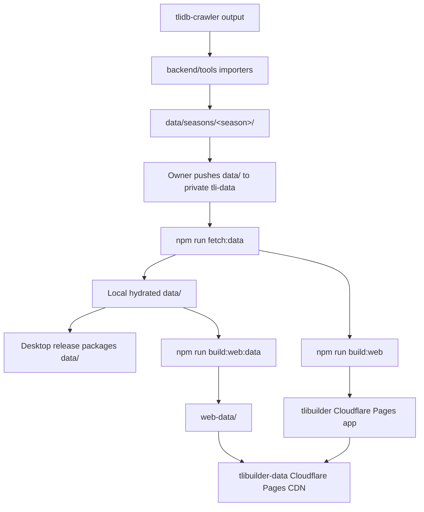

# Data and release pipeline
> Last verified against: 5e6ddd4 (2026-09-25).

## Overview

The private `tli-data` repository is the dataset of record. This repository does not track `data/`. A checkout hydrates it with `npm run fetch:data`, which runs `scripts/fetch-data.mjs`. That script clones `tli-data`, replaces the local dataset, and preserves only `data/builds/`.

The pipeline has two separate outputs. Desktop release builds package the hydrated `data/` directory. The web build consumes an export under `web-data/`, which deploys to the separate `tlibuilder-data` Cloudflare Pages project. Keep the data deployment separate from the application deployment because they have different triggers and outputs.

## Key concepts

- **Dataset of record.** `tli-data` owns the distributable `data/` directory. `scripts/fetch-data.mjs` reads `TLI_DATA_REPO`, `TLI_DATA_REF`, and `TLI_DATA_TOKEN` when it fetches it.
- **Hydrated local data.** The local `data/` directory is a working copy. `fetch-data.mjs` removes its entries before copying the fetched dataset, except for `data/builds/`.
- **Season directory.** Imported season catalogs live under `data/seasons/<season>/`. `backend/tools/reimport_season.py` writes each selected season through `season_manager` save functions.
- **Crawler and importers.** The `data-scraper` lane owns acquisition from `tlidb-crawler` and the import path. `reimport_season.py` coordinates importers in `backend/tools/`, including `season_importer.import_crawler_tree()`, `legendary_gear_importer.import_crawler_items()`, `skill_importer`, `hero_trait_importer.import_crawler_hero_traits()`, and `pact_spirit_importer.import_crawler_spirits()`.
- **Web-data export.** `backend/tools/export_web_data.py::main()` writes the active season's static catalogs and `manifest.json`. `backend/tools/export_engine_bundle.py::main()` writes `engine-data.zip` for the browser-side engine.

## How it works

The crawler is the acquisition boundary. The importers convert crawler output into the season catalogs. `backend/tools/reimport_season.py::main()` selects the import steps, and its `_STEPS` sequence runs trees before the dependent node-type filter. The `step_filter()` guard does not rebuild the global `data/node_type_filter.json` for a non-active season.

After the importers have produced the intended `data/` content, the owner pushes that dataset to private `tli-data`. A Builder checkout does not publish a changed local `data/` directory. The normal consumer path is `npm run fetch:data`, which invokes `scripts/fetch-data.mjs`. The script fetches the configured branch or tag, copies its `data/` directory into the checkout, and removes obsolete local catalog files as part of the replacement.

The release workflows all hydrate data before they build. `.github/workflows/ci.yml` fetches it before the backend test job. `.github/workflows/release.yml` fetches it before it packages and publishes a tagged desktop release. `.github/workflows/nightly.yml` does the same before it publishes a prerelease from `staging`.

For the hosted app, `npm run build:web:data` runs `export_web_data.py` and `export_engine_bundle.py`. `export_web_data.py::main()` calls the catalog handlers listed in `CATALOGS`, writes them below `web-data/<active season>/`, copies icons, and writes `web-data/manifest.json`. `export_engine_bundle.py::main()` reads the active season from `server.season_manager.get_active_season()` and packages the engine's required data into `web-data/engine-data.zip`.

`.github/workflows/deploy-web-data.yml` runs only when manually dispatched from `main`. It fetches `tli-data`, builds `web-data/`, deploys that directory to the `tlibuilder-data` production branch, and checks that the live CDN serves the same `manifest.json`, `engine-data.zip`, and season catalogs, byte for byte. `export_engine_bundle.py` writes `engine-data.zip` reproducibly (fixed entry timestamps and attributes), so identical data always produces identical bytes. Both deploy workflows and both `deploy:web*` npm scripts pass `--branch=main`; without it, Wrangler takes the branch from git and a run from any other branch publishes only a preview. `.github/workflows/deploy-web.yml` deploys only the web application. It runs on pushes to `main`, fetches data for the build, sets `VITE_STATIC_DATA_BASE` to the data CDN, deploys `dist-web`, and verifies the application site. The app reads the CDN through that build-time base URL, as described in [Desktop and web shells](desktop-and-web.md).

## Where things live

- `scripts/fetch-data.mjs`: fetches and replaces the local dataset from private `tli-data`.
- `backend/tools/reimport_season.py`: coordinates the crawler-to-season import steps.
- `backend/tools/*_importer.py`: converts crawler records into the data shapes saved under `data/seasons/<season>/`.
- `backend/tools/export_web_data.py`: exports static catalog JSON, icons, `manifest.json`, and the CDN worker into `web-data/`.
- `backend/tools/export_engine_bundle.py`: creates `web-data/engine-data.zip`.
- `package.json`: defines `fetch:data`, `build:web:data`, `deploy:web`, and `deploy:web:data`.
- `.github/workflows/ci.yml`: runs the frontend checks and hydrated-data backend job on `dev` and `main` pushes and pull requests.
- `.github/workflows/release.yml`: packages and publishes a desktop release for tags matching `v[0-9]*`.
- `.github/workflows/deploy-web.yml`: deploys `dist-web` on pushes to `main` or a manual dispatch.
- `.github/workflows/deploy-web-data.yml`: manually deploys the generated data CDN output.
- `.github/workflows/nightly.yml`: packages and publishes a nightly prerelease on `staging` pushes or a manual dispatch.

## Gotchas

- A local `data/` directory is never canonical. A stale local dataset shipped the 0.6.3 build. Fetch `tli-data` before deciding that data or a data-derived result has changed.
- Do not commit `data/` to this repository. The `data-scraper` lane refreshes the dataset through the crawler and importer path, then the owner pushes it to `tli-data`.
- Do not assume that a web app deployment updates the CDN. `deploy-web.yml` and `deploy-web-data.yml` deploy different directories to different Cloudflare Pages projects.
- The web-data deployment has no push trigger because the private dataset refresh occurs outside this repository. Run `deploy:web:data` or dispatch `deploy-web-data.yml` after the fetched dataset changes and the CDN must catch up.
- A changed season import can leave runtime caches stale. `reimport_season.py::main()` reports that the backend must restart after import. Its node-type-filter step also skips a non-active season to avoid replacing the global filter with the wrong season's data.
