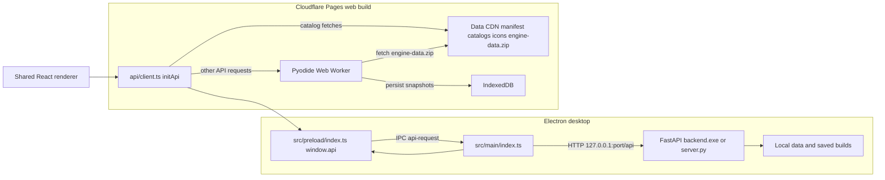

# Desktop and web shells
> Last verified against: 5e6ddd4 (2026-09-25).

## Overview

TLI Builder has one React renderer in `src/renderer`, but it runs in two different shells. The desktop shell uses Electron to host the renderer and starts a local FastAPI process. The web shell builds the same renderer with Vite, then runs the Python backend inside a Pyodide Web Worker.

The shared API module, `src/renderer/src/api/client.ts`, picks the route at startup. `initApi()` detects Electron from `window.api.apiRequest`. On desktop, `get`, `post`, `put`, and `del` call the preload bridge. On the hosted site, selected catalog reads use the data CDN, and other API calls go to `webApiRequest()` in `web/pyodideCompute.ts`.

This split keeps renderer feature work mostly shared, but it means a feature can fail in either the native-process boundary or the browser-worker boundary. Start debugging by confirming which shell supplied the data, computed the request, and persisted the result.

## Key concepts

- **Electron main process.** `src/main/index.ts` owns the native window, the local backend process, Electron IPC handlers, packaged-app protocol handling, and the updater.
- **Preload bridge.** `src/preload/index.ts` exposes the narrow `window.api` object through `contextBridge`. The renderer cannot import Electron directly.
- **Local backend.** `backend/server.py` creates the FastAPI `app`. Desktop runs it over loopback. Its `lifespan()` function prints the ready line that Electron uses to learn the bound port.
- **Web compute worker.** `src/renderer/src/web/computeWorker.ts` loads Pyodide, unpacks Python and engine data, imports `server`, and dispatches requests to `server.app` as ASGI calls. It does not open a network listener.
- **Static data CDN.** The web build reads `VITE_STATIC_DATA_BASE` from `.env.web`. `initApi()` first fetches its `manifest.json`, then maps supported catalog paths to season-specific JSON and icon URLs under that base.

## How it works

### Desktop startup and requests

`app.whenReady()` in `src/main/index.ts` registers handlers, calls `createWindow()`, and then starts Python with `startPython()`. The window appears before the backend is ready. A renderer call to `window.api.getPythonPort()` waits in the `portWaiters` queue until `resolvePort()` runs.

`startPython()` selects port 8765 for a packaged app and 8766 for an unpackaged app. An unpackaged end-to-end run can replace that with `TLI_E2E_PYTHON_PORT`. It calls `killPortProcess()` for the selected port before spawning. Packaged builds start `resources/backend.exe`. Unpackaged builds start `backend/server.py` through `TLI_DEV_PYTHON`, a local virtual environment, or the primary checkout's virtual environment.

The Python process prints `TLI backend running on port <port>` from `backend/server.py`'s `lifespan()` function. Electron reads that output, calls `waitForPort()` to make a TCP connection to `127.0.0.1`, and finally calls `resolvePort()`. The server itself uses `find_free_port()` if the preferred port is unavailable, so the renderer must use the port that Electron supplies rather than assuming the preferred one.

After startup, the renderer calls `window.api.apiRequest()`. The preload bridge sends the request to Electron's `api-request` handler, which fetches `http://127.0.0.1:<port>/api<path>`. The renderer's `iconUrl()` still uses a loopback URL because an image element cannot use the IPC bridge.

The desktop main process also owns native-only behavior. `initUpdater()` configures `electron-updater`, checks packaged applications after the window is ready, and forwards update events through preload callbacks. `report-request` posts reports to the fixed `REPORT_SERVICE_URL`, so `submitBugReport()` in `src/renderer/src/api/share.ts` uses that bridge on desktop. `safeOpenExternal()` limits native external opens to HTTP or HTTPS URLs.

Packaged builds alone register `tlibuilder://`, take the single-instance lock, and handle `second-instance`, `open-url`, and cold-start arguments. `extractShareId()` accepts only `tlibuilder://import/<id>`, and `deliverDeepLink()` forwards the ID as `deep-link-share`. `src/preload/index.ts` exposes that event as `onDeepLinkShare()`, which `App.tsx` handles through the same import flow as a web share query.

Unpackaged runs deliberately skip the single-instance lock and deep-link registration. `TLI_E2E_USERDATA` can move Electron user data, `TLI_E2E_PYTHON_PORT` can isolate the backend port, `TLI_DEV_PYTHON` can select an interpreter, and `TLI_DATA_DIR` reaches the development backend through its inherited environment. `bootstrapDataDir()` uses the selected data directory in development. In a packaged application, it copies and refreshes bundled data in Electron user data while preserving saved builds and `save.json`.

### Web startup and requests

`vite.web.config.mts` builds `src/renderer` into `dist-web`. It uses `index.web.html` and `view.html` as entries, and `build:web` renames the first output to `index.html`. The config embeds the package version and a content hash for `backend-py.zip`.

With `VITE_STATIC_DATA_BASE=https://tlibuilder-data.pages.dev` in `.env.web`, `initApi()` reads `<base>/manifest.json` to choose the season. Its `STATIC_CATALOGS` mapping sends supported catalog requests to `<base>/<season>/<catalog>.json` and points icons at `<base>/icons`. Requests that are not intercepted this way call `webApiRequest()`.

`initPyodideCompute()` creates one module worker and gives it the CDN base, season, content-hashed `backend-py.zip`, and the saved-build snapshot. `computeWorker.ts` loads Pyodide and FastAPI, downloads `backend-py.zip` and `<base>/engine-data.zip`, sets `TLI_DATA_DIR` to its in-memory `/data`, imports `server`, then invokes `server.app` with an ASGI scope for every request. The worker serializes requests, and `pyodideCompute.ts` also serializes them, because the in-browser Python runtime has one execution thread.

The web shell persists build files differently. The worker restores `/persist` from an IndexedDB snapshot and sends a new snapshot after successful build or save mutations. `pyodideCompute.ts` owns the IndexedDB read and write. A worker startup failure, crash, unreadable message, or request timeout rejects pending work and lets a later request create a new worker.

`build:web:data` runs `backend/tools/export_web_data.py` and `backend/tools/export_engine_bundle.py`. The first writes catalog JSON, `manifest.json`, icons, and the generated data-CDN worker into `web-data`. The second writes `engine-data.zip` from the data files the in-browser backend reads. `build:web` separately runs `backend/tools/export_backend_bundle.py` before compiling the app, so the app publishes the Python modules that the worker imports.

`package.json` deploys `dist-web` to the `tlibuilder` Cloudflare Pages project and `web-data` to the separate `tlibuilder-data` project. The two deployments are separate because the app bundle and the season data have different build outputs and update cadence.

### Desktop packaging

`electron.vite.config.ts` builds the Electron main process, preload, and renderer. Its renderer configuration sets `publicDir: false`, so web-only files such as `backend-py.zip` do not enter the desktop renderer bundle.

`package.json` runs PyInstaller with `backend/backend.spec` for `build:backend`, producing `backend-dist/backend.exe`. The `electron-builder` configuration includes the Electron output and resources, then copies that executable and the `data` directory into `extraResources`. A packaged Electron process starts the copied executable from `process.resourcesPath`.

## Where things live

- `src/main/index.ts`: Electron window lifecycle, Python spawn and readiness, IPC, deep links, updater, report transport, and development isolation.
- `src/preload/index.ts` and `src/preload/index.d.ts`: the `window.api` bridge and its renderer type.
- `electron.vite.config.ts`: Electron main, preload, and renderer build configuration.
- `backend/server.py`: FastAPI `app`, `lifespan()`, and `find_free_port()`.
- `src/renderer/src/api/client.ts`: shell detection, catalog routing, and common API methods.
- `src/renderer/src/web/pyodideCompute.ts`: worker lifecycle, request queue, timeouts, and IndexedDB persistence.
- `src/renderer/src/web/computeWorker.ts`: Pyodide setup and in-process ASGI request dispatch.
- `vite.web.config.mts` and `.env.web`: web build configuration and the data-CDN base URL.
- `backend/tools/export_backend_bundle.py`: creates the Python bundle served with the web app.
- `backend/tools/export_web_data.py` and `backend/tools/export_engine_bundle.py`: create the data-CDN catalogs, icons, and engine bundle.
- `package.json`: desktop packaging commands, web build commands, and Cloudflare Pages deployment commands.

## Gotchas

- Do not test a desktop-only issue by opening the hosted site. The hosted site has no `window.api`, no local TCP server, no Electron updater, and no desktop deep-link registration.
- Do not test a web-only issue through Electron. Electron does not load `backend-py.zip`, start Pyodide, fetch static catalogs from `VITE_STATIC_DATA_BASE`, or use IndexedDB for build persistence.
- If a desktop request starts before the backend is usable, check `startPython()`, the ready line from `lifespan()`, `waitForPort()`, and the port passed through `get-python-port`. Do not hard-code 8765 because `find_free_port()` can select another port.
- If desktop and development builds interfere, inspect the selected port and data directory first. `killPortProcess()` terminates the listener on the selected port before startup. The packaged and unpackaged defaults differ to reduce that collision, and `TLI_E2E_*` values exist only for unpackaged isolation.
- If only the web target has stale or missing data, inspect `manifest.json`, the season path selected by `initApi()`, the generated `web-data` output, and the CDN base embedded at build time. The app deploy and the data deploy are separate.
- If only web computation hangs or fails, inspect the worker's Pyodide package load, `backend-py.zip`, `engine-data.zip`, and the worker error or timeout path. The web request queue is intentional, so concurrent API calls wait for the current worker request.
- `submitBugReport()` has different transports by design. Desktop uses the main-process `report-request` handler. The web shell uses `fetch` to the public report endpoint.
