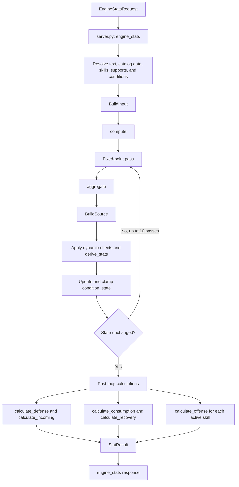

# Stat engine pipeline
> Last verified against: 5e6ddd4 (2026-09-25).

## Overview

The stat engine turns the `/api/engine/stats` request into a `StatResult`. The HTTP handler in [`backend/server.py`](../../backend/server.py) resolves request fields into contributions, skills, and condition inputs. [`compute()`](../../backend/engine/compute.py) then aggregates those inputs, derives effective character stats, settles feedback-dependent conditions, and calculates the returned offense, defense, recovery, and consumption views.

This page is the current description of that flow. It replaces the pipeline and modifier-system descriptions in [`docs/damage-pipeline.md`](../damage-pipeline.md) and [`docs/modifier-system.md`](../modifier-system.md) where they disagree with the current implementation. For the pooling rules in more detail, read [`docs/ADDITIONAL_DAMAGE_POOLING.md`](../ADDITIONAL_DAMAGE_POOLING.md). For the convergence design, read [`docs/ENGINE_FEEDBACK_LOOPS.md`](../ENGINE_FEEDBACK_LOOPS.md). For code-change touchpoints, read [`docs/ENGINE_AUTHORING.md`](../ENGINE_AUTHORING.md).

## Key concepts

`EngineStatsRequest` is the request model for `engine_stats()` in [`backend/server.py`](../../backend/server.py). It holds the build payload, including the selected trees, gear, skills, supports, condition state, and target settings.

`BuildInput` in [`backend/engine/models.py`](../../backend/engine/models.py) is the engine-facing version of that request. The server fills it with resolved contribution dictionaries and already-loaded season data.

`BuildSource` is the per-pass collection of numeric stat entries. It keeps source metadata in `source_log`, plus separate scoped and slot-local entries. `materialize_for_skill()` combines the applicable entries only when an offense calculation needs a particular skill and slot.

`SourceEntry` records the stat key, amount, source text, source type, and optional scope, slot, and pooling identity. The engine uses that metadata for stat breakdowns and for rules that need distinct-source identity.

`condition_state` is the mutable state that crosses calculation passes. `_derive_views()` in [`backend/engine/compute.py`](../../backend/engine/compute.py) turns it into active boolean conditions and numeric values. `aggregate()` in [`backend/engine/aggregator.py`](../../backend/engine/aggregator.py) uses those views to include, exclude, or scale contributions.

## How it works

### Resolve the request before calculation

`engine_stats()` loads the requested season trees and skill data, removes disabled skill slots and their hosted supports, and resolves several request fields before calling `compute()`. It calls helpers such as `_resolve_custom_mod()`, `resolve_core_talents()`, and `resolve_nodes()` to create contribution dictionaries. It also resolves attached supports and builds the `BuildInput` object before the call to `compute()`.

Modifier text reaches the engine through [`backend/engine/mod_parser.py`](../../backend/engine/mod_parser.py). `_parse_custom_mod_text()` first separates a recognized skill scope with `detect_skill_scope()`, then calls `_parse_custom_mod_text_base()`. The base parser handles explicit forms and calls `_resolve_gear_stat()` for catalog-backed matching. A resolved contribution has a `stat_key`, numeric `amount`, original `text`, and sometimes a `scope`. If the parser cannot resolve the text, `_resolve_custom_mod()` returns an unresolved status instead of a contribution.

The server also translates recognized conditional text into condition expressions before it constructs `BuildInput`. The engine evaluates those expressions in `_eval_condition()` during aggregation. A contribution can be enabled by a boolean condition, rejected by a comparison, or scaled by a numeric `per` expression.

### Aggregate source entries and preserve scope

`compute()` starts with a copy of `BuildInput.condition_state`. On each pass, it calls `_derive_views()` and then `aggregate()`. `aggregate()` creates a new `BuildSource` for that pass and emits the resolved gear, character, node, slate, support, trait, memory, spirit, custom, and other engine contributions.

`_emit()` in `aggregator.py` decides where each entry goes. A global entry uses `BuildSource.add_with_source()`. A skill-scoped entry uses `add_scoped()`. A slot-local entry uses `add_slotted()`. The latter two do not become global totals. `calculate_offense()` receives their applicable values through `BuildSource.materialize_for_skill()`.

This distinction matters because the same stat key can have global, skill-scoped, and slot-local contributions. The engine does not flatten them before it knows which skill is being calculated.

### Apply increase, additional, and derived-stat rules

`derive_stats()` in [`backend/engine/derive.py`](../../backend/engine/derive.py) calculates the effective stats listed in `ALL_DERIVED_STATS`. For each definition, it adds the flat inputs, applies the summed increased inputs as one factor, and then applies each configured additional pool. It writes each derived result back into the current `BuildSource`, so later work in the same pass can read it.

`_additional_pool_factor()` applies source-tracked additional entries as separate factors. For example, it multiplies each entry's `1 + amount` factor. If no source entries exist, it falls back to the combined stat total. Local gear defense follows a separate per-item path through `local_gear_defense_sources()` and `local_gear_defense_total()` before global derived-stat scaling.

Offense uses its own tag-aware additional pools. `_build_additional_factors()` in [`backend/engine/offense.py`](../../backend/engine/offense.py) groups positive entries with the same pooling identity, keeps negative entries separate, and returns the factors that apply to a skill. `_additional_product()` multiplies the matching factors. `pool_identity()` can use the catalog-derived identity index attached by `aggregate()` so matching definition-level text groups as one source. The exact distinctions and exceptions are documented in [`docs/ADDITIONAL_DAMAGE_POOLING.md`](../ADDITIONAL_DAMAGE_POOLING.md).

### Settle conditions and rate-dependent values

The body of `compute()` runs at most `_MAX_ITERS`, currently 10, passes. Each pass rebuilds `BuildSource` rather than adding to the previous pass. Values that must feed the next pass stay in `condition_state` or in the small prior-pass variables maintained by `compute()`.

During a pass, `compute()` applies condition-derived support effects, dynamic buffs, reservation, and `derive_stats()`. It calls `derive_condition_maximums()` and `derive_condition_minimums()`, then `_clamp_and_rederive()` to clamp numeric conditions and refresh related boolean flags. `_state_snapshot()` checks whether the state has stopped changing. If it has not, the next pass starts from the new state.

The loop also handles feedback that depends on resource consumption. `calculate_consumption()` in [`backend/engine/consumption.py`](../../backend/engine/consumption.py) converts typed consume-rate stats into per-second drains and rolling recent-consumption totals. For each resource pool that needs a calculated current percentage, `compute()` calls `solve_steady_pool_pct()` in [`backend/engine/sustain_solve.py`](../../backend/engine/sustain_solve.py). That function uses `calculate_consumption()` and `calculate_recovery()` to bisect the percentage where the selected pool's net recovery is zero, then rounds the answer to `LIFE_PCT_QUANTUM`.

Some rate feedback uses damped previous values and quantized values in the convergence snapshot. Those rules keep the loop from stopping while a feedback value still changes. [`docs/ENGINE_FEEDBACK_LOOPS.md`](../ENGINE_FEEDBACK_LOOPS.md) explains the design and the implementation examples.

### Calculate the final views

After the condition state settles, `compute()` builds the final stat map and runs the display calculations with source-read recording enabled.

`calculate_defense()` in [`backend/engine/defense.py`](../../backend/engine/defense.py) reads the derived pools and mitigation inputs into `DefenseResult`. `calculate_incoming()` uses that result with the selected incoming configuration to create the defensive incoming-damage view.

`calculate_consumption()` runs again with the final defense, reservation, skill rates, and active-skill costs. `calculate_recovery()` then uses the final consumption result to produce the recovery view. The returned `consumption` and `skill_cost` fields remain separate because the code calculates them separately.

For every enabled active skill, `_offense_for_slot()` in `compute()` resolves the skill, applies slot effects, materializes that slot's source, and calls `calculate_offense()`. `calculate_offense()` applies the skill's tags and damage forms, rate calculations, target mitigation, and the relevant increased and additional factors. `compute()` selects the main slot's result for `StatResult.offense` and also returns `slot_offense` for the other active slots.

Finally, `compute()` returns `StatResult`. `engine_stats()` serializes its stat map, condition limits and clamp report, calculated views, source-consumption information, and the server-side resolution statuses into the HTTP response.

## Where things live

- [`backend/server.py`](../../backend/server.py): `EngineStatsRequest`, `engine_stats()`, request-side resolution, and response serialization.
- [`backend/engine/models.py`](../../backend/engine/models.py): `BuildInput`, `BuildSource`, `SourceEntry`, and `StatResult`.
- [`backend/engine/compute.py`](../../backend/engine/compute.py): `compute()`, condition views, fixed-point orchestration, and final result assembly.
- [`backend/engine/aggregator.py`](../../backend/engine/aggregator.py): `aggregate()`, `_eval_condition()`, and contribution routing.
- [`backend/engine/mod_parser.py`](../../backend/engine/mod_parser.py): `_parse_custom_mod_text()`, `_parse_custom_mod_text_base()`, and `_resolve_gear_stat()`.
- [`backend/engine/derive.py`](../../backend/engine/derive.py): `ALL_DERIVED_STATS`, `derive_stats()`, and additional-pool handling for derived stats.
- [`backend/engine/offense.py`](../../backend/engine/offense.py): `calculate_offense()`, `_build_additional_factors()`, and `_additional_product()`.
- [`backend/engine/defense.py`](../../backend/engine/defense.py): `calculate_defense()` and `calculate_incoming()`.
- [`backend/engine/consumption.py`](../../backend/engine/consumption.py): `calculate_consumption()` and `ConsumptionResult`.
- [`backend/engine/sustain_solve.py`](../../backend/engine/sustain_solve.py): `solve_steady_pool_pct()`.

## Gotchas

- `aggregate()` is intentionally repeatable. Do not add a value to a prior pass's `BuildSource` and expect it to persist. Put cross-pass state in `condition_state` or the explicit prior-pass state that `compute()` maintains.
- A contribution can exist in `source_log` without being global. Check its `scope` and `slot`, then trace `materialize_for_skill()` before concluding that a total is missing.
- `derive_stats()` injects derived values into the source. Read derived values only after that call in the same pass.
- `additional` does not have one universal accumulation rule. Derived stats use `_additional_pool_factor()`. Offense uses tag filtering and pooling identity. Read the relevant calculation and [`docs/ADDITIONAL_DAMAGE_POOLING.md`](../ADDITIONAL_DAMAGE_POOLING.md) before changing a pool.
- `calculate_offense()` runs after convergence. If a new mechanic changes a value that influences a condition, rate, consumption, or other pass input, it belongs in the fixed-point work before the final offense call.
- `solve_steady_pool_pct()` assumes the net value changes monotonically across the resource percentage range. Its bisection result is quantized, and `compute()` may keep a manually supplied percentage instead of replacing it with the solved one.
