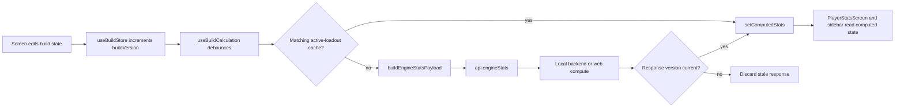

# Renderer architecture
> Last verified against: 5e6ddd4 (2026-09-25).

## Overview

The renderer is the React application under `src/renderer/src/`. `App.tsx` starts its API transport, loads shared reference data, owns the current screen, and coordinates opening and saving builds. Zustand stores hold the build, catalog, mapping-cache, and user-preference state so screens can subscribe to small slices of shared data.

The renderer sends typed requests through `api/client.ts`. In the desktop build, those requests use Electron IPC to reach the local backend. In a browser build, catalog requests can use static data and calculation requests can use the web compute worker. The share service is deliberately separate: `api/share.ts` uses `fetch` against `SHARE_BASE`, rather than the local backend.

## Key Concepts

- `useBuildStore` in `store/buildStore.ts` is the working build. Its input setters advance `buildVersion`. Its calculation setters update `computedStats` and `computedVersion` without advancing `buildVersion`.
- A loadout is a named set of build-area snapshots. A loadout can inherit an individual area from another loadout. `resolvedPatch()` and `loadoutKeyFromResolved()` in `utils/loadoutAreas.ts` resolve that view and identify it for the calculation cache.
- `useReferenceStore` in `store/referenceStore.ts` holds catalog responses shared by screens. It records failed catalog names and the settled-fetch progress, rather than treating one failed catalog as a failed application startup.
- `useMappingStore` in `store/mappingStore.ts` caches raw modifier-text mappings returned by `api.mapModifiers()`. It batches missing mappings for 100 milliseconds.
- `useUiPrefs` in `store/uiPrefsStore.ts` persists renderer-only preferences with Zustand's `persist` middleware under `tli-ui-prefs`.

## How It Works

### Startup and navigation

`App()` calls `initApi()`, then loads tree metadata, pact-spirit data, and `useReferenceStore.getState().loadReferenceData()`. `initApi()` selects the desktop IPC path, a local HTTP path, or the web-build path. `App.tsx` keeps `screen` as local React state and renders the build list and verification screen without the build sidebar. Once a build is open, `BuildSidebar` selects the main screens.

The kept-alive editing screens are `BuildOverviewScreen`, `GearScreen`, `SkillsScreen`, `HeroTraitScreen`, `PactSpiritScreen`, `SlateScreen`, `NotesScreen`, and `ImportExportOverlay`. `App.tsx` mounts each on its first visit and hides it while another screen is active. `PlayerStatsScreen` and the tree and preview screens are swap-rendered instead. This distinction preserves unfinished editor-local state without keeping the calculation screen mounted.

The sidebar reaches configuration, calculations, notes, talent-tree selection and viewing, slates, gear, skills, hero traits, pact spirits, import and export, settings, and loadout management. `BuildSelectScreen` opens or creates builds. `VerificationDatabaseScreen` and `DevToolsScreen` are separate root-level routes. Each named screen is imported and selected in `App.tsx`.

### Open, save, and unsaved changes

`openBuild()` sanitizes the loaded payload before passing it to `useBuildStore.getState().loadBuild()`. It restores missing defaults, migrates legacy condition data with `migrateOldConditions()`, refreshes saved gear-affix fields through `api.resolveGearAffixes()`, and calls `ensureLoadouts()` for builds that predate loadouts. It then calls `flushActiveLoadout()`, records the loaded `buildVersion`, clears the dirty flag, and opens the hero-trait landing screen.

`saveBuild()` and `saveAsBuild()` first call `flushActiveLoadout()`. They then send the full build payload through `api.postBuild()`. A normal save includes the current build ID. Save As omits it. Both store the returned ID, update the name, re-baseline the dirty tracker, and clear the dirty flag. `assignNewBuildToFolder()` makes a best-effort folder assignment after the first save of a build created from a folder.

`requireSavePrompt()` protects actions that replace or leave an open dirty build, including returning to the build list and opening an imported build. It stores the pending action in `pendingUnsavedActionRef`. `handleUnsavedSave()` saves first and then runs that action. `handleUnsavedDiscard()` clears the dirty flag and runs it. Cancel closes the dialog and drops the action. The same gate protects share-link imports initiated by the web query parameter or the desktop deep-link callback.

### Loadouts and recalculation

`BuildSidebar` opens `LoadoutOverlay`, which uses `switchLoadout()` and `editLoadouts()` from `useBuildStore`. Creating, duplicating, editing, or deleting a loadout flows through `editLoadouts()`. The store flushes the active loadout before a structural edit, resolves the newly active view into live state, increments `buildVersion`, and invalidates or refreshes the relevant cached result. `LoadoutOverlay` prevents inheritance cycles with `chainReaches()` and converts direct inheritors to their resolved snapshots before deletion.

`useBuildCalculation()` watches `buildVersion` and `spiritsResolved`. After a 150-millisecond debounce, it skips work when `computedVersion` is current. It also reuses the active loadout's cached result when `loadoutKeyFromState()` matches. Otherwise it sets `statsLoading`, builds an engine payload with `buildEngineStatsPayload()`, calls `api.engineStats()`, and accepts the response only if its captured version is not older than the current computed version. A response for an unchanged build is saved with `cacheActiveLoadoutStats()`.

### Reference data and API boundaries

`loadReferenceData()` starts the reference catalog requests together and uses `Promise.allSettled()`. It takes the season from fulfilled responses that include one and builds lookup tables for skills. The module-level `loadToken` prevents an older request batch from replacing a newer batch. `clearReferenceData()` increments that token, resets the catalog state, and clears the registered skill-tag vocabulary.

`DevToolsScreen` receives an `onSeasonChange` callback from `App.tsx`. That callback calls `clearReferenceData()`, starts `loadReferenceData()` again, and clears `useMappingStore`; its cached mappings are valid only for the data version that produced them. A screen changing the active season must preserve this sequence.

`api/client.ts` defines the request helpers, response types, and the `api` object used by renderer code. `get()`, `post()`, `put()`, and `del()` centralize IPC, HTTP, static-catalog, and web-compute behavior. Keep calls typed by adding them to this module, rather than placing transport code in a screen.

`api/share.ts` is the exception. `shareBuildCode()` and `fetchSharedBuildCode()` call `postToShareService()` and `getFromShareService()`, which use direct requests to `SHARE_BASE`. They apply request timeouts and size limits for shared build codes. `client.ts` re-exports those functions on `api`, but it does not route them through the local backend.

## Where Things Live

| Path | Starting point |
| --- | --- |
| `src/renderer/src/App.tsx` | `App()`, `openBuild()`, `saveBuild()`, `requireSavePrompt()`, and the screen switch. |
| `src/renderer/src/store/buildStore.ts` | `useBuildStore`, `loadBuild()`, `flushActiveLoadout()`, `switchLoadout()`, and computed-stat state. |
| `src/renderer/src/store/useBuildCalculation.ts` | `useBuildCalculation()`, the background calculation trigger. |
| `src/renderer/src/store/referenceStore.ts` | `loadReferenceData()`, `clearReferenceData()`, and catalog loading state. |
| `src/renderer/src/store/mappingStore.ts` | `useMappingStore`, `modifierKey()`, and the debounced mapping batch. |
| `src/renderer/src/store/uiPrefsStore.ts` | `useUiPrefs` and persisted display preferences. |
| `src/renderer/src/api/client.ts` | `initApi()`, transport helpers, API types, and `api`. |
| `src/renderer/src/api/share.ts` | `getShareBase()`, `shareBuildCode()`, and `fetchSharedBuildCode()`. |
| `src/renderer/src/components/BuildSidebar.tsx` and `src/renderer/src/components/LoadoutOverlay.tsx` | Main navigation and loadout management. |
| `src/renderer/src/screens/` | The screen components selected by `App.tsx`. |
| `ui-panel` skill | The `ui-panel` skill for changes to calculation panels. |

## Gotchas

- Do not put a hook below `App.tsx`'s `if (!appReady)` return. The component would call a different number of hooks before and after startup.
- Do not update `buildVersion` when storing calculated results. `useBuildCalculation()` relies on that separation to avoid a calculation loop.
- Flush the active loadout before serializing a build. Its live state can contain edits that have not yet been written back to its snapshot.
- Preserve the `loadToken` check when changing reference loading. Without it, a slow earlier season request can overwrite newer catalog state.
- Clear `useMappingStore` whenever the reference data version changes. Its keys are cached modifier mappings, not universal results.
- Keep share-service calls in `api/share.ts`. Calling the local-backend helpers for a share request changes the intended process boundary.
