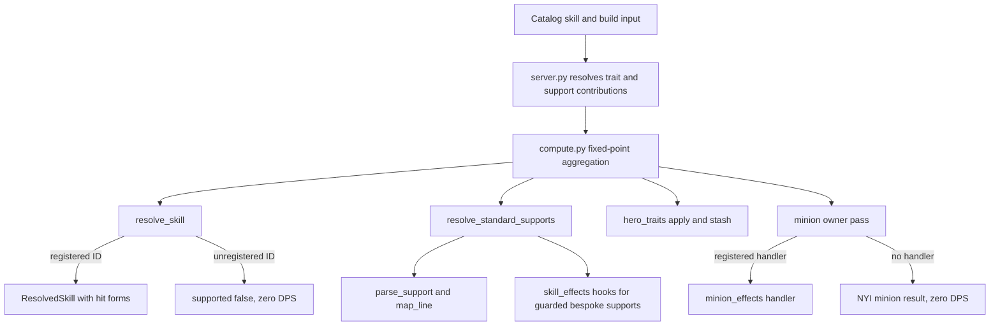

# Skills, supports, hero traits, and minions

> Last verified against: 5e6ddd4 (2026-09-25).

## Overview

The engine separates data that describes an equipped skill from code that can calculate its damage. `engine.skill_resolver.resolve_skill()` turns a catalog record into a `ResolvedSkill`. The resolver accepts only skill IDs registered in `skill_resolver._REGISTRY`; an unregistered skill has `supported=False`, no hit forms, and computes zero DPS. The engine still retains enough metadata for cost, rate, and partial-support display.

Supports, hero traits, and minions use the same rule: generic text flows through shared resolvers, while behavior that needs a dedicated damage model has an explicit registry entry. This keeps unsupported mechanics visible without turning guessed numbers into DPS.

## Key concepts

`ResolvedSkill` is the input contract for player offense. It carries the skill identity, tags, level data, hit forms, and optional spell, channel, intrinsic-damage, and damage-over-time fields. Individual functions decorated with `_register()` populate it from catalog data.

`SupportLine` and `ParsedSupport` in `engine.support_lines` describe the generic support path. `parse_support()` extracts the support gate, level-scaled progression lines, and the remaining flat text. `engine.support_mapper.map_line()` maps a line to stat contributions. It first handles added-flat and conditional patterns, then delegates ordinary stat text to `engine.mod_parser._parse_custom_mod_text()`.

Hero-trait modules expose only the hooks their mechanics need. `engine.hero_traits` builds registries for `apply`, `stash`, `status_lines`, `virtual_supports`, and `spirit_grant` from the modules it imports. A module can add contributions during the fixed-point loop, retain a converged value for the next pass, report modeled and informational lines, grant a virtual support, or describe a post-offense autonomous skill copy.

Minion owners are not player skill slots. `engine.compute.compute()` finds catalog skills with nested `minion_skills` and sends each owner to the minion pass. A minion needs a handler registered in `engine.minion_offense.MINION_MODULES` before it adds DPS.

## How it works

`backend/server.py` first determines whether a selected hero trait has a bespoke module. For one that does, it calls `hero_traits.status_lines()` and leaves contribution calculation to `compute()`. Otherwise, the server passes the trait's ordinary effect text through its generic effect resolver. The server also filters disabled supports, appends trait-provided virtual supports with `hero_traits.virtual_supports()`, and calls `resolve_support_contributions()` and `resolve_support_behavior()`.

During each aggregation pass, `compute()` calls `hero_traits.apply()` before it aggregates contributions. It calls `resolve_standard_supports()` with the current condition state, so condition-derived support effects can settle in the same loop. At the bottom of the pass, it calls `hero_traits.stash()` for values the trait needs on the next pass. `compute()` handles `hero_traits.spirit_grant()` after player offense because that hook needs the resolved main-skill source.

`resolve_standard_supports()` handles standard support skills and activation-media lines. It parses support gates per host slot, maps generic stat lines, and returns contributions plus automatic condition effects. `resolve_support_contributions()` handles ranked support types separately: rank controls the universal line, while the support's `level` selects its progression tier. `support_level_summary()` adds the support-level bonuses that match the support's own tags. `resolve_support_behavior()` returns non-stat, slot-scoped behavior such as shotgun, chains, lucky damage, or an augmentation value.

The generic route is deliberately not a fallback for every support. `engine.skill_effects.__init__` collects modules that declare guarded support IDs and optional hooks. `resolve_support_contributions()` skips the generic specific-line parser for a guarded ID and calls `skill_effects.support_contribution()`. Later, `compute()` calls `skill_effects.apply_slot_effects()` and `skill_effects.preseed()` where a skill-specific module supplies them. The [support modeling specification](../SUPPORT_MODELING_SPEC.md) records the line-level coverage and unresolved cases.

`resolve_skill()` returns a registered resolver's result when the skill ID is in `_REGISTRY`. The registry contains the active skills whose damage forms have an explicit model. Several skills also have files under `backend/engine/skill_effects/` for mechanics that do not belong in the generic resolver. If the ID is absent, `resolve_skill()` creates an unsupported `ResolvedSkill`; `compute()` preserves the slot output but `engine.offense` receives no hit forms, so total DPS is `0.0`. Supports cannot turn that into a damage calculation.

The minion pass imports `engine.minion_effects`, whose package initializer registers each module's `OWNER_ID` and `handler` in `MINION_MODULES`. `compute()` materializes a minion-scoped source for the owner's slot and calls the handler only when `minion_offense.is_modeled()` is true. Otherwise, `minion_offense.nyi_owner()` returns the owner's abilities as NYI with no DPS. `minion_offense.calculate_minion_offense()` consumes minion-specific pools, and `to_minion_stat()` and `to_minion_stat_strict()` provide the player-to-minion remapping used by support and transfer paths. `minion_effects/thunder_magus.py::handler()` is the registered bespoke example. See [minion modifier coverage](../MINION_MOD_COVERAGE.md) for consumed, inert, and missing minion modifiers.

Hero traits that need bespoke behavior live one per file in `backend/engine/hero_traits/`, then join `_MODULES` in `__init__.py`. Their `apply()` functions use `slot_levels` and `advanced_picks`; the per-trait `_enabled()` helpers make a negative slot level disable that node. Traits without a bespoke module can still use the server's generic effect-text path.

Dance of the Deep uses a different input shape. `backend/tools/hero_trait_importer.py::_dance_of_the_deep_tree_fields()` emits `allocation_mode`, `tree_root_id`, `tree_nodes`, and `tree_connections`. `HeroTraitTree.tsx` uses `canAllocate()`, `allocate()`, `deallocate()`, and `reconcile()` to maintain an adjacency-gated allocation list within the Hero Memory budget. The current verification entry says this is selection and allocation data only: there is no `hero_traits/dance_of_the_deep.py` module and no engine DPS effect. See [Dance of the Deep verification](../verification/dance-of-the-deep.md).

## Where things live

- `backend/engine/skill_resolver.py`: `ResolvedSkill`, `_REGISTRY`, `_register()`, and `resolve_skill()`.
- `backend/engine/skill_effects/`: skill-specific intrinsic and support hooks. Start with its [README](../../backend/engine/skill_effects/README.md).
- `backend/engine/support_lines.py`, `support_mapper.py`, and `support_resolver.py`: generic support parsing, mapping, ranks, tiers, and behavior.
- `backend/engine/hero_traits/`: trait registry, per-trait modules, and the hook contract in `README.md`.
- `backend/engine/minion_offense.py` and `backend/engine/minion_effects/`: minion stat handling, DPS calculation, and registered owner handlers.
- `backend/engine/compute.py` and `backend/server.py`: the orchestration points that join these systems.
- the `add-skill` skill, the `add-support` skill, the `add-hero-trait` skill, and the `add-verification` skill: the implementation recipes.

## Gotchas

- A catalog entry is not a DPS model. Confirm that its ID is in `skill_resolver._REGISTRY` before investigating support damage.
- A support's `rank` and `level` mean different things. The ranked universal effect reads `rank`; tier-specific progression reads `level`.
- Keep special support mechanics in `skill_effects/`. Do not add a second generic mapping for a guarded support line, or the engine can count it twice.
- Keep minion stats in the minion pool. `to_minion_stat_strict()` returns no mapping when the engine has no minion equivalent, rather than applying a player stat to a minion.
- Tree allocation does not imply a modeled trait mechanic. Dance of the Deep remains zero-effect in the engine until a registered trait module implements it.
